# FM Genie Scout UI/UX Redesign
## User Flows Documentation

**Version:** 1.0  
**Date:** December 2025  
**Author:** Product Team  

---

## Table of Contents

1. [Overview](#overview)
2. [User Personas](#user-personas)
3. [Core User Flows](#core-user-flows)
   - [Flow 1: Application Launch & Game Loading](#flow-1-application-launch--game-loading)
   - [Flow 2: Player Search & Filtering](#flow-2-player-search--filtering)
   - [Flow 3: Staff Search & Filtering](#flow-3-staff-search--filtering)
   - [Flow 4: Club Search & Filtering](#flow-4-club-search--filtering)
   - [Flow 5: Player Profile Exploration](#flow-5-player-profile-exploration)
   - [Flow 6: Shortlist Management](#flow-6-shortlist-management)
   - [Flow 7: Player Comparison](#flow-7-player-comparison)
   - [Flow 8: Rating System Customization](#flow-8-rating-system-customization)
   - [Flow 9: History Points & Snapshots](#flow-9-history-points--snapshots)
   - [Flow 10: Data Export](#flow-10-data-export)
4. ["g" Edition Gated Flows](#g-edition-gated-flows)
   - [Flow 11: GS STATS Development Forecast](#flow-11-gs-stats-development-forecast)
   - [Flow 12: Role Finder](#flow-12-role-finder)
   - [Flow 13: Top Lists](#flow-13-top-lists)
   - [Flow 14: Probability of Development](#flow-14-probability-of-development)
   - [Flow 15: In-Game Scout (IGS)](#flow-15-in-game-scout-igs)
5. [Error States & Edge Cases](#error-states--edge-cases)
6. [State Management Considerations](#state-management-considerations)

---

## Overview

This document defines all user flows for the FM Genie Scout redesign. Each flow is mapped with:
- Entry points
- Decision nodes
- Success/failure states
- "g" Edition gates (where applicable)
- State transitions

**Design Principles Applied:**
- Progressive disclosure for complexity management
- Real-time feedback for filter operations
- Virtualized rendering for 250k+ records
- Consistent navigation patterns across entities

---

## User Personas

| Persona | Description | Primary Goals |
|---------|-------------|---------------|
| **New Player** | First-time FM companion tool user. Finds current interface intimidating. | Load save quickly, run simple searches, export shortlist with minimal config |
| **Experienced Scout** | Long-time user familiar with CA/PA ratings and advanced filters. | Customize ratings, build complex filters, compare players/staff, export for analysis |
| **"g" Edition User** | Paying user accessing predictive features (GS STATS, Role Finder, Top Lists). | Leverage projections and top-lists to optimize transfers and development |

---

## Core User Flows

### Flow 1: Application Launch & Game Loading

**Trigger:** User launches FM Genie Scout application

**Actors:** All personas


**State Transitions:**

| State | Description | Data Required |
|-------|-------------|---------------|
| `IDLE` | App launched, no save loaded | None |
| `DETECTING` | Scanning for FM process | OS process list |
| `LOADING` | Parsing save file | File path, FM version |
| `READY` | Save loaded, features enabled | Full database in memory |
| `ERROR` | Load failed | Error type, message |

**Success Criteria:**
- Save loads in < 30 seconds for 250k records
- Progress bar shows meaningful status messages
- Directory paths persisted for next session
- Auto-sync shortlist from FM enabled by default

---

### Flow 2: Player Search & Filtering

**Trigger:** User wants to find players matching specific criteria

**Actors:** All personas (complexity varies)


**Filter Categories Structure:**

```
Players Filter Panel
├── Presets (Quick Access)
│   ├── Wonderkids
│   ├── Top Bargains  
│   ├── Free Agents
│   └── Custom Saved Filters
├── General
│   ├── Position (Multi-select chips)
│   ├── Age (Dual-handle slider)
│   ├── Nationality (Searchable dropdown)
│   └── Division (Hierarchical dropdown)
├── CA/PA & Rating
│   ├── Current Ability (Slider 1-200)
│   ├── Potential Ability (Slider 1-200)
│   └── Minimum Rating % (Slider 0-100)
├── Contract
│   ├── Status (Pill buttons)
│   ├── Market Value (Range input)
│   ├── Sale Value (Range input)
│   ├── Wages (Range input)
│   └── Budget Helper (Toggle + input)
├── Attributes (Collapsible)
│   ├── Technical (Grid of sliders)
│   ├── Mental (Grid of sliders)
│   ├── Physical (Grid of sliders)
│   ├── Hidden (Collapsed by default)
│   ├── Personality (Radio buttons)
│   └── Preferred Moves (Searchable multi-select)
└── [g Edition] Advanced Projection
    └── Search by Peak Attributes (Toggle)
```

**Real-Time Count Update Logic:**
- Debounce filter changes (300ms)
- Run count query on virtualized index
- Display count next to each active filter
- Total count in results header

---

### Flow 3: Staff Search & Filtering

**Trigger:** User wants to find staff (coaches, scouts, physios)

**Actors:** All personas



```mermaid
flowchart TD
    A[Open Filter Panel] --> B[Select 'Staff' Tab]
    
    B --> C{Select Role Preset?}
    C -->|Head of Youth Dev| D[Apply: Youth + High JPA/JPP]
    C -->|Assistant Manager| E[Apply: Tactical + Man Management]
    C -->|Scout| F[Apply: JPA + JPP + Adaptability]
    C -->|Physio| G[Apply: Physiotherapy + Sports Science]
    C -->|Coach| H[Show Coaching Category Filters]
    C -->|Custom| I[Show All Filters]
    
    D --> J[Update Results Real-Time]
    E --> J
    F --> J
    G --> J
    H --> J
    I --> J
    
    I --> K[General Filters]
    K --> K1[Age Range]
    K --> K2[Name Search]
    K --> K3[Nationality]
    K --> K4[Contract Status]
    
    I --> L[Training Ratings]
    L --> L1[Star Rating Sliders by Category]
    L --> L2[Attacking ★★★★★]
    L --> L3[Defending ★★★★★]
    L --> L4[Tactical ★★★★★]
    L --> L5[Technical ★★★★★]
    L --> L6[Mental ★★★★★]
    L --> L7[Fitness ★★★★★]
    L --> L8[Goalkeeping ★★★★★]
    
    I --> M[CA/PA Range]
    M --> M1[Current Ability Slider]
    M --> M2[Potential Ability Slider]
    
    I --> N[Hidden Attributes]
    N --> N1[Judging Player Ability]
    N --> N2[Judging Player Potential]
    N --> N3[Level of Discipline]
    N --> N4[Motivating]
    N --> N5[Man Management]
    
    J --> O{Results Count}
    O -->|Has Results| P[Render Staff Cards View]
    O -->|No Results| Q[Show Suggestions]
    
    P --> R{User Action}
    R -->|Click Card| S[Open Staff Profile]
    R -->|Compare| T[Select Multiple for Comparison]
    R -->|Add to Consideration| U[Add to Staff Shortlist]
```

**Staff Filter Structure:**

```
Staff Filter Panel
├── Role Presets
│   ├── Head of Youth Development
│   ├── Assistant Manager
│   ├── Scout
│   ├── Physio
│   └── Coach (by specialty)
├── General
│   ├── Age Range
│   ├── Name Search
│   ├── Nationality
│   └── Contract Status
├── Training Ratings (Star Sliders)
│   ├── Attacking (0-5 stars)
│   ├── Defending (0-5 stars)
│   ├── Tactical (0-5 stars)
│   ├── Technical (0-5 stars)
│   ├── Mental (0-5 stars)
│   ├── Fitness (0-5 stars)
│   └── Goalkeeping (0-5 stars)
├── CA/PA
│   ├── Current Ability
│   └── Potential Ability
└── Hidden Attributes
    ├── Judging Player Ability
    ├── Judging Player Potential
    ├── Level of Discipline
    ├── Motivating
    └── Man Management
```

---

### Flow 4: Club Search & Filtering

**Trigger:** User wants to explore clubs (transfers, vacancies, facilities)

**Actors:** All personas


**Cross-Entity Linking:**

When viewing a club, users can:
1. **Jump to Players:** Pre-filter player search by club
2. **Jump to Staff:** Pre-filter staff search by club
3. **View Top XI:** Auto-generate best lineup

---

### Flow 5: Player Profile Exploration

**Trigger:** User clicks on a player from search results or shortlist

**Actors:** All personas


**Profile Tab Data Structure:**

```typescript
interface PlayerProfile {
  // Header
  id: string;
  name: string;
  age: number;
  nationality: string[];
  club: Club;
  position: Position[];
  status: PlayerStatus[];
  portraitPath?: string;
  
  // Attributes
  technical: Record<TechnicalAttribute, number>;
  mental: Record<MentalAttribute, number>;
  physical: Record<PhysicalAttribute, number>;
  hidden: Record<HiddenAttribute, number>;
  
  // Abilities
  currentAbility: number;
  potentialAbility: number;
  
  // Contract
  wage: number;
  marketValue: number;
  saleValue: number;
  releaseClauses: ReleaseClause[];
  contractExpiry: Date;
  
  // Positions
  positionRatings: Record<Position, number>;
  preferredFoot: 'Left' | 'Right' | 'Either';
  weakFootAbility: number;
  preferredMoves: string[];
  
  // g Edition
  gsStats?: {
    projectedAttributes: ProjectedAttribute[];
    peakAge: number;
    developmentProbability: number;
    progressRate: 'Slow' | 'Normal' | 'Fast';
    idealSaleWindow: DateRange;
  };
  
  // History
  historyPoints: HistoryPoint[];
}
```

---

### Flow 6: Shortlist Management

**Trigger:** User wants to organize scouted players

**Actors:** All personas


**Annotation System:**

| Tag Color | Label | Use Case |
|-----------|-------|----------|
| 🟢 Green | Target | Primary transfer target |
| 🟡 Yellow | Watchlist | Monitor for future |
| 🔵 Blue | Loan | Loan candidate |
| 🟠 Orange | Academy | Youth prospect |
| 🔴 Red | Avoid | Flagged issues |
| ⚪ Gray | Archived | No longer relevant |

---

### Flow 7: Player Comparison

**Trigger:** User wants to compare two or more players

**Actors:** All personas


---

### Flow 8: Rating System Customization

**Trigger:** User wants to create custom player rating weights

**Actors:** Experienced Scout, "g" Edition User


---

### Flow 9: History Points & Snapshots

**Trigger:** User wants to track player development over time

**Actors:** All personas


---

### Flow 10: Data Export

**Trigger:** User wants to export data for external analysis

**Actors:** All personas


---

## "g" Edition Gated Flows

All flows in this section require active "g" Edition subscription. Non-subscribers see upgrade prompts.

### Flow 11: GS STATS Development Forecast

**Trigger:** User views player development predictions

**Gate:** "g" Edition subscription required


---

### Flow 12: Role Finder

**Trigger:** User wants to find players for specific tactical roles

**Gate:** "g" Edition subscription required


---

### Flow 13: Top Lists

**Trigger:** User wants to browse curated best player lists

**Gate:** "g" Edition subscription required


---

### Flow 14: Probability of Development

**Trigger:** User views development probability indicators

**Gate:** "g" Edition subscription required


---

### Flow 15: In-Game Scout (IGS)

**Trigger:** User activates overlay while in Football Manager

**Gate:** "g" Edition subscription required


---

## Error States & Edge Cases

### Error State Definitions

| Error Code | Trigger | User Message | Recovery Action |
|------------|---------|--------------|-----------------|
| `E001` | FM process not found | "Football Manager is not running. Please launch FM and load a save." | Retry detection or manual file pick |
| `E002` | Invalid save file | "This file doesn't appear to be a valid FM save." | Select different file |
| `E003` | Save version mismatch | "This save is from FM[X]. Genie Scout supports FM[Y-Z]." | Update GS or use compatible save |
| `E004` | Parse timeout | "Loading is taking longer than expected. Large databases may need a moment." | Wait or cancel |
| `E005` | Memory limit | "Database too large for available memory." | Suggest closing other apps |
| `E006` | Network error (g Edition) | "Cannot connect to GS STATS. Check your internet connection." | Retry or work offline |
| `E007` | Subscription expired | "Your g Edition subscription has expired." | Renew or continue with basic |
| `E008` | Graphics not found | "Face/kit packs not found in FM graphics folder." | Configure path or use placeholders |
| `E009` | Export failed | "Could not save file to selected location." | Choose different location |
| `E010` | Filter timeout | "Filter query timed out. Try narrowing your search." | Adjust filters |

### Edge Case Handling


---

## State Management Considerations

### Global Application State

```typescript
interface AppState {
  // Core
  isLoading: boolean;
  loadProgress: number;
  loadStatus: string;
  error: AppError | null;
  
  // Database
  database: {
    loaded: boolean;
    playerCount: number;
    staffCount: number;
    clubCount: number;
    fmVersion: string;
    lastLoaded: Date;
  };
  
  // User Preferences
  preferences: {
    theme: 'light' | 'dark';
    savedDirectories: {
      fmInstall: string;
      fmSaves: string;
      fmGraphics: string;
      exports: string;
    };
    autoSync: boolean;
    defaultColumns: ColumnConfig;
    favoriteFilters: SavedFilter[];
  };
  
  // Session
  session: {
    activeShortlist: Shortlist | null;
    recentSearches: FilterConfig[];
    comparisonPlayers: Player[];
    historyStack: NavigationState[];
  };
  
  // Subscription
  subscription: {
    isGEdition: boolean;
    expiryDate: Date | null;
    features: GEditionFeature[];
  };
}
```

### Virtualization Strategy for 250k+ Records

```typescript
interface VirtualizationConfig {
  // Window settings
  itemHeight: 48; // pixels
  overscan: 10; // extra items rendered above/below viewport
  
  // Chunking
  chunkSize: 1000; // items per chunk
  maxRendered: 100; // max items in DOM at once
  
  // Indexing
  indexes: {
    byPosition: Map<Position, number[]>;
    byNationality: Map<string, number[]>;
    byClub: Map<string, number[]>;
    byAbilityRange: Map<string, number[]>;
  };
  
  // Caching
  cache: {
    recentFilters: LRUCache<string, number[]>;
    maxCacheSize: 50; // cached filter results
  };
}
```

---

## Next Steps

1. **Component Specification Document** - Detailed component breakdown with props, state, and styling
2. **Wireframes** - Visual mockups for key screens
3. **Technical Architecture** - Tauri + React implementation details
4. **API Contracts** - Data structures and IPC communication

---

*Document Version: 1.0 | Last Updated: December 2025*
